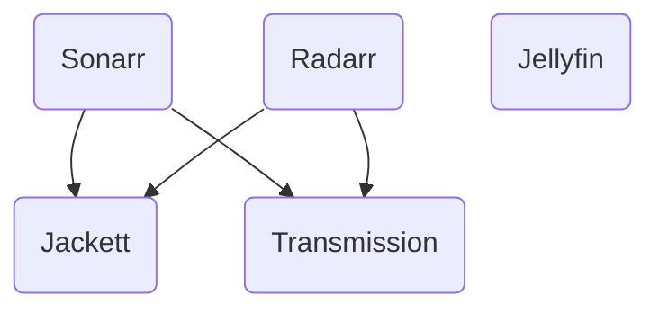

# Helm Mediaserver

## Prerequisites

- Helm
- Enough disk space on the host (11Gb with default configuration)
- Nothing bound on port 443 (e.g. traefik)

## Components

## Setup

1. Add helm repository
    - `helm repo add mediaserver https://muellner.dev/helm-mediaserver/`
2. Install the Helm Chart
    - Set `nginx.host` to valid domain (e.g. `media.local`)
    - `helm install mediaserver mediaserver/helm-mediaserver -f <custom-values.yaml>`
3. Modify base paths correctly when using ingress controller
    - Set `BasePathOverride` to `/jackett` in `config/jackett/Jackett/ServerConfig.json`
    - Set `UrlBase` to `/sonarr` in `config/sonarr/config.xml`
    - Set `UrlBase` to `/radarr` in `config/radarr/config.xml`
4. Components can be accessed
    - jackett: `<host>/jackett` (e.g. `media.local/jackett`)
    - transmission: `<host>/transmission` (e.g. `media.local/transmission`)
    - sonarr: `<host>/sonarr` (e.g. `media.local/sonarr`)
    - radarr: `<host>/radarr` (e.g. `media.local/radarr`)
    - jellyfin: `<host>` (e.g. `media.local`)
5. Finish configuration via Web UI